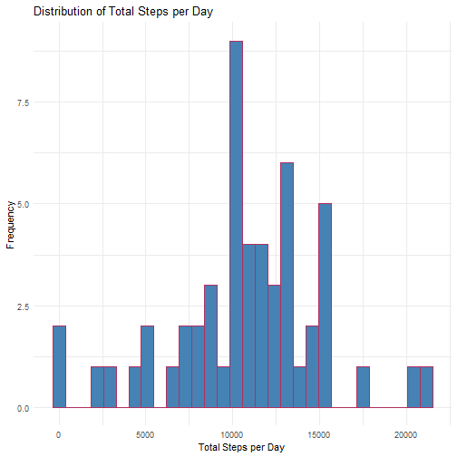
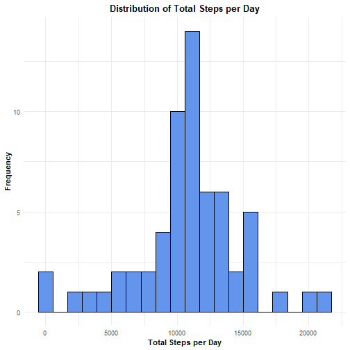
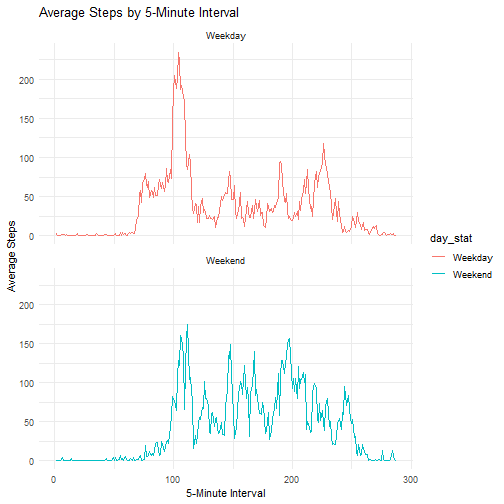

This analysis examines activity tracking data to understand patterns in the daily number of steps taken, explore variations in activity across different times of day, and investigate differences in activity between weekdays and weekends. Using data from an activity-tracking device, we aim to address questions such as the total steps taken per day, the average daily activity pattern, and whether step counts vary between weekdays and weekends. In addition to summarizing the dataset’s descriptive statistics, we address missing values by imputing data based on daily averages to ensure continuity in our analysis. The findings offer insights into the typical daily activity trends, including which intervals of the day tend to be the most active. The analysis is presented through descriptive statistics, visualizations, and daily patterns, leveraging R for reproducible research.

### Loading Data and Packages
This brief analysis will require the following packages: 


```r
#### Loading the packages 

library(dplyr)
library(ggplot2)
```

```
## Warning: package 'ggplot2' was built under R version 4.2.3
```

```r
library(readxl)
library(readr)
```


```r
#### Loading the dataset 

setwd("/")
setwd("C:/Users/QARA/Documents/Coursera/Data Science Specialization-JH/Reproducible Research/repdata_data_activity")
activity <- read_csv("activity.csv")
```

```
## Rows: 17568 Columns: 3
## ── Column specification ────────────────────────────────────────────────────────────────────────────────────────────────────────
## Delimiter: ","
## dbl  (2): steps, interval
## date (1): date
## 
## ℹ Use `spec()` to retrieve the full column specification for this data.
## ℹ Specify the column types or set `show_col_types = FALSE` to quiet this message.
```

```r
activity$interval <- as.factor(activity$interval)
str(activity)
```

```
## spc_tbl_ [17,568 × 3] (S3: spec_tbl_df/tbl_df/tbl/data.frame)
##  $ steps   : num [1:17568] NA NA NA NA NA NA NA NA NA NA ...
##  $ date    : Date[1:17568], format: "2012-10-01" "2012-10-01" "2012-10-01" "2012-10-01" ...
##  $ interval: Factor w/ 288 levels "0","5","10","15",..: 1 2 3 4 5 6 7 8 9 10 ...
##  - attr(*, "spec")=
##   .. cols(
##   ..   steps = col_double(),
##   ..   date = col_date(format = ""),
##   ..   interval = col_double()
##   .. )
##  - attr(*, "problems")=<externalptr>
```

## Assignemnt Questions

### 1. Calculation for Number of Steps Taken 
#### 1.1 What is mean total number of steps taken per day?


```r
step_day <- activity %>% group_by(date) %>% summarize (total_steps_day = sum(steps))
x <- sum(step_day$total_steps_day, na.rm = TRUE)
```

The total number of steps taken per day is 570608. 

#### 1.2 Histogram of Total Number of Steps Each Day

```r
ggplot(step_day, aes(x = total_steps_day)) + 
  geom_histogram(fill = "steelblue", color = "maroon") +
  labs(
    title = "Distribution of Total Steps per Day",
    x = "Total Steps per Day",
    y = "Frequency"
  ) +
  theme_minimal()
```

```
## `stat_bin()` using `bins = 30`. Pick better value with `binwidth`.
```

```
## Warning: Removed 8 rows containing non-finite outside the scale range (`stat_bin()`).
```




#### 1.3 Mean and Median of the Total Number of steps taken per day


```r
### calculating mean and median of steps per day 

x <- mean(step_day$total_steps_day, na.rm = TRUE)
y <- median(step_day$total_steps_day, na.rm = TRUE)
```

The mean of total number of steps taken per day is 10766.19 and the median of the total number of steps taken per day is 10765


### 2. What is the average daily activity pattern?


```r
activity$interval <- as.numeric(activity$interval)

average_step <- activity %>% group_by(interval) %>% summarize(avg_step = mean(steps, na.rm = TRUE))


ggplot(average_step, aes(x = interval, y = avg_step)) + 
  geom_line(color = "darkblue", size = 1) +
  labs(
    title = "Average Steps by 5-Minute Interval",
    x = "5-Minute Interval",
    y = "Average Steps"
  ) +
  theme_minimal() +
  theme(
    plot.title = element_text(hjust = 0.5, face = "bold"),
    axis.title = element_text(face = "bold")
  )
```

```
## Warning: Using `size` aesthetic for lines was deprecated in ggplot2 3.4.0.
## ℹ Please use `linewidth` instead.
## This warning is displayed once every 8 hours.
## Call `lifecycle::last_lifecycle_warnings()` to see where this warning was generated.
```


```r
### which 5 minute interval has the most steps walked 
z <- average_step %>%  filter(avg_step == max(avg_step)) 
str(z)
```

```
## tibble [1 × 2] (S3: tbl_df/tbl/data.frame)
##  $ interval: num 104
##  $ avg_step: num 206
```
The summary statisics and the time-series plot reveal that the 5-minute interval with the maximum number of steps is 104, 206.1698113


### 3. Imputing Missing Values 

#### 3.1 Total number of missing values in the dataset


```r
### Dealing with missing values 
z <- sum(is.na(activity)) ### Total number of NAs in the dataset
```

The total number of missing values in the dataset is 2304

#### 3.2 Filling NAs with the overall average of steps taken per day


```r
### average step per day 
day_step_average <- activity %>% group_by(date) %>% summarize(avg_step = mean(steps, na.rm = TRUE))

sum(is.na(day_step_average))
```

```
## [1] 8
```

```r
### Replacing the NAs with the average of total steps in the dataset 

revised_data <- activity %>% mutate (new_steps = if_else(is.na(steps), 37.3826, steps)) %>% select(- steps)

step_per_day <- revised_data %>% group_by(date) %>% summarize(total_steps_day = sum(new_steps))

ggplot(step_per_day, aes(x = total_steps_day)) + 
  geom_histogram(fill = "cornflowerblue", color = "black", bins = 20) +
  labs(
    title = "Distribution of Total Steps per Day",
    x = "Total Steps per Day",
    y = "Frequency"
  ) +
  theme_minimal() +
  theme(
    plot.title = element_text(hjust = 0.5, face = "bold"),
    axis.title = element_text(face = "bold")
  )
```



```r
x <- mean(revised_data$new_steps)
y <- median(revised_data$new_steps)
```

The missing values in the dataset was filled with the overall average of the number of steps taken. The histogram plot reveales the differences between the distribution of steps without missing values. The revised mean after filling the missiong values is 37.3826 and the median of the number steps taken after filling the missing values is 0. 


### 4. Are there differences in activity patterns between weekdays and weekends?
The visual comparison of weekday and weekend activity patterns indicates that individuals tend to have higher step counts in specific intervals on weekdays, reflecting more structured routines. In contrast, weekend activity patterns are less structured, with step counts more evenly distributed, suggesting a more relaxed or varied schedule. This difference highlights how daily routines and possibly lifestyle factors influence physical activity patterns between weekdays and weekends.

```r
### Dataset with replaced NAs
revised_activity <- activity %>% mutate (new_steps = if_else(is.na(steps), 37.3826, steps))


revised_activity <- revised_activity %>% mutate (weekday =weekdays(date))

### Calculating week end and week days
print_day <- function(x) {
  
  # Initialize an empty character vector to store results
  y <- character(length(x))
  
  # Loop through the indices of x
  for (i in seq_along(x)) {
    if (x[i] == "Saturday" || x[i] == "Sunday") {
      y[i] <- "Weekend"
    } else {
      y[i] <- "Weekday"
    }
  }
  
  return(y)
}


revised_activity <- revised_activity %>% mutate (day_stat = print_day(weekday))


avg_step <- revised_activity %>% group_by(interval, day_stat) %>% summarize(avg_step = mean(steps, na.rm = TRUE))
```

```
## `summarise()` has grouped output by 'interval'. You can override using the `.groups` argument.
```

```r
ggplot(avg_step, aes(x = interval, y = avg_step, colour = day_stat)) + geom_line() + facet_wrap(~ day_stat, ncol = 1) + labs(title = "Average Steps by 5-Minute Interval",
       x = "5-Minute Interval",
       y = "Average Steps") +
  theme_minimal()
```




## Conclusion 
This analysis of daily step activity patterns provides insights into the total number of steps taken per day, the average daily activity pattern, and the differences between weekday and weekend activity. Using the filled-in dataset for missing values, we observed distinct differences in step patterns between weekdays and weekends, with weekends generally showing higher average step counts in certain intervals. The linear trend analysis across 5-minute intervals illustrates a variation in activity intensity, with peak intervals identified for both weekday and weekend days. This analysis highlights the significance of understanding daily activity patterns, which can inform decisions in health tracking, personal fitness goals, and designing interventions aimed at improving physical activity.


